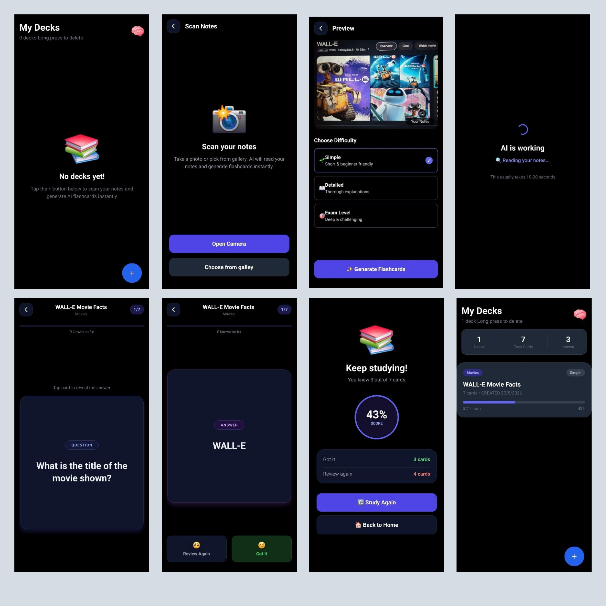
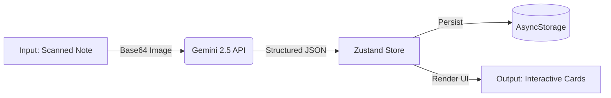

# AI Flashcard App 🧠⚡

An AI-powered mobile flashcard generator built.

The app allows users to scan handwritten notes or textbook pages using their camera (or pick from the gallery) and instantly generates study flashcard decks customized to their chosen difficulty.

---

## 🖼️ UI Showcase



---

## 🚶‍♂️ User Guide

1. 📸 **Scan:** Tap `+` to photograph study notes or pick an image from your gallery.
2. ⚙️ **Select Difficulty:** Choose **Simple**, **Detailed**, or **Exam Level**.
3. ✨ **Generate:** Tap **Generate Flashcards** to build your deck instantly using AI.
4. 🧠 **Study:** Tap cards to flip, rate your recall (`Got It` / `Review Again`), and track your score.

---

## 🛠️ Technology Stack

* 📱 **Core Framework:** React Native & Expo (v54) with Expo Router
* 🛡️ **Language:** TypeScript
* 🧠 **State Engine:** Zustand (global store & action handlers)
* 💾 **Caching:** AsyncStorage (persistent local cache)
* 🎨 **UI & Styling:** NativeWind (Tailwind CSS) & Ionicons
* 🤖 **AI Integration:** Gemini 2.5 Flash API (Axios REST + structured JSON schema)

---

## 📊 Data Flow




---

## 📂 File Structure

* 📂 **`app/`** — Application screens and routes:
  * `_layout.tsx` — App entry, routing, and gesture handler wrapper
  * `index.tsx` — Dashboard & study deck list (Home)
  * `camera.tsx` — Camera scanner & gallery picker
  * `preview.tsx` — Image preview & difficulty selector
  * `generating.tsx` — Loader managing active API calls
  * `study.tsx` — Flipcard study mode & performance results
* 📂 **`services/`** — External integrations (`geminiApi.ts`)
* 📂 **`store/`** — Zustand global state managers (`flashcardStore.tsx`)
* 📂 **`types/`** — TypeScript interfaces and schemas
* ⚙️ **`app.json`** — Native app settings, icons, and permissions

---

## 🚀 Local Setup

Follow these steps to configure and run the project locally on your machine:

### 📋 Prerequisites
* **Node.js** (v18 or higher recommended)
* **npm** (bundled with Node.js)
* **Git** installed on your command line
* **Expo Go** app installed on your physical mobile device (iOS/Android)

### ⚙️ Installation & Running

1. **Clone the Repository:**
   ```bash
   git clone https://github.com/Subhradeep-Sikder/AI-FlashCard-app.git
   cd AI-FlashCard-app
   ```

2. **Install Dependencies:**
   ```bash
   npm install
   ```

3. **Configure Environment:**
   Create a `.env` file in the root directory:
   ```env
   EXPO_PUBLIC_GEMINI_API_KEY=""
   ```
   *(Get a free key from [Google AI Studio](https://aistudio.google.com/))*

4. **Launch Development Server:**
   ```bash
   npx expo start -c
   ```

5. **Scan & Play:**
   * **Physical Phone:** Scan the QR code displayed in the terminal using your phone's camera (iOS) or the Expo Go app scanner (Android).
   * **Emulators:** Press `i` for iOS Simulator or `a` for Android Emulator (requires local simulator environments).

## 🔮 Future Improvements

* 🔐 **User Authentication:** Secure user signup and login (e.g., Supabase Auth / Clerk ).
* 🗄️ **Database Sync:** Connect a cloud database (Supabase / PostgreSQL {Prisma ORM }) to save and sync decks across devices.
* 📄 **Document Uploads:** Support multi-page PDF imports and scanning.
* 🗣️ **Audio Reader:** Integrate Text-to-Speech to read flashcards aloud.

##

Built with ❤️

